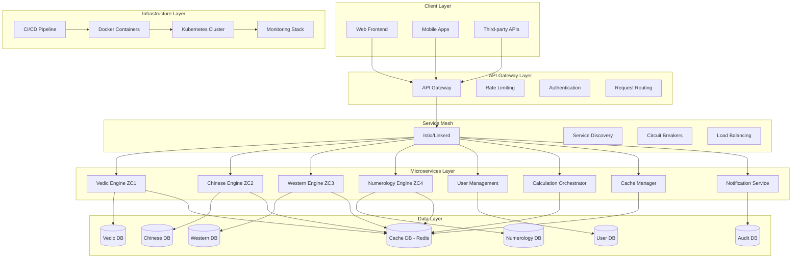

# ZodiaCore ZC1-ZC4 System Architecture

## Overview

ZodiaCore is a comprehensive multi-system astrology platform implementing Vedic (ZC1), Chinese (ZC2), Western (ZC3), and Numerology (ZC4) astrology services. The architecture follows microservices principles with DB-first and API-first design approaches, ensuring scalability, maintainability, and compliance with development rules.

## System Architecture



## Service Boundaries & Responsibilities

### 1. Vedic Engine (ZC1) - Indian/Vedic Astrology
**Responsibilities:**
- Birth chart (Kundali) generation with Lahiri Ayanamsa
- Dasha & planetary transit calculations
- Divisional charts (D1-D60 Vargas)
- Muhurat (auspicious timing) calculations
- Panchang calendar services
- Horoscope generation (daily/weekly/monthly/yearly)
- Return charts (Solar/Lunar)
- Compatibility analysis (Synastry, Guna Milan)
- Dosha analysis (Manglik, Nadi, etc.)
- Specialized consultations (medical, career, relationships)
- Mundane astrology predictions
- Yoga formation analysis
- Karmic debt analysis (Lal Kitab)
- Transit analysis and alerts
- Yantra recommendations
- Charity guidance
- Fasting (Vrata) recommendations

**Database:** PostgreSQL with Vedic astrology schemas
**Cache:** Redis for calculation results
**External Dependencies:** Astronomical calculation libraries

### 2. Chinese Engine (ZC2) - Chinese Astrology
**Responsibilities:**
- Birth chart generation (Ba-Zi, Four Pillars)
- Five Elements and Nine Star Ki calculations
- Chinese lunar calendar operations
- Zodiac compatibility analysis
- Chinese horoscope generation
- Feng Shui remedies and guidance

**Database:** PostgreSQL with Chinese astrology schemas
**Cache:** Redis for calendar and calculation results
**External Dependencies:** Lunar calendar libraries

### 3. Western Engine (ZC3) - Western Astrology
**Responsibilities:**
- Birth chart generation with multiple house systems
- Planetary position calculations (VSOP87)
- Aspect analysis and interpretations
- Transit and progression calculations
- Return chart analysis
- Synastry and composite charts
- Western horoscope generation
- Medical astrology analysis
- Career and relationship counseling

**Database:** PostgreSQL with Western astrology schemas
**Cache:** Redis for ephemeris data
**External Dependencies:** Astronomical calculation libraries

### 4. Numerology Engine (ZC4) - Numerology Services
**Responsibilities:**
- Life Path, Destiny, Soul Urge calculations
- Personal year/month/day cycle analysis
- Lucky number generation
- Auspicious timing integration
- Name analysis and compatibility

**Database:** PostgreSQL with numerology schemas
**Cache:** Redis for calculation results
**External Dependencies:** Minimal (pure mathematical calculations)

### 5. User Management Service
**Responsibilities:**
- User authentication and authorization
- Profile management
- Session handling
- API key management
- User preferences and settings

### 6. Calculation Orchestrator
**Responsibilities:**
- Coordinate complex multi-system calculations
- Manage calculation workflows
- Handle cross-service dependencies
- Optimize calculation performance
- Provide unified calculation APIs

### 7. Cache Manager
**Responsibilities:**
- Centralized caching strategy
- Cache invalidation policies
- Performance optimization
- Memory management

### 8. Notification Service
**Responsibilities:**
- Transit alerts
- Horoscope notifications
- Reminder services
- Email/SMS integration

## Data Architecture

### Database Design Principles
- **Separation of Concerns:** Each astrology system has its own database
- **Data Integrity:** Foreign key relationships and constraints
- **Performance:** Proper indexing and query optimization
- **Scalability:** Sharding and partitioning strategies
- **Backup & Recovery:** Automated backup procedures

### Schema Overview

```sql
-- Shared Tables
CREATE TABLE users (
    id UUID PRIMARY KEY,
    email VARCHAR(255) UNIQUE,
    created_at TIMESTAMP,
    updated_at TIMESTAMP
);

CREATE TABLE user_preferences (
    user_id UUID REFERENCES users(id),
    astrology_system VARCHAR(50),
    preferences JSONB,
    PRIMARY KEY (user_id, astrology_system)
);

-- Vedic Database (ZC1)
CREATE TABLE vedic_birth_charts (
    id UUID PRIMARY KEY,
    user_id UUID REFERENCES users(id),
    birth_data JSONB,
    chart_data JSONB,
    created_at TIMESTAMP
);

CREATE TABLE vedic_calculations (
    id UUID PRIMARY KEY,
    chart_id UUID REFERENCES vedic_birth_charts(id),
    calculation_type VARCHAR(100),
    parameters JSONB,
    results JSONB,
    created_at TIMESTAMP
);

-- Similar structures for ZC2, ZC3, ZC4 databases
```

## API Architecture

### API Design Principles
- **RESTful Design:** Resource-based URLs with HTTP methods
- **Versioning:** URL-based versioning (/v1/, /v2/)
- **Consistent Response Format:** Standardized JSON responses
- **Error Handling:** Structured error responses with codes
- **Rate Limiting:** Token bucket algorithm implementation
- **Documentation:** OpenAPI/Swagger specifications

### API Endpoints Structure

```
/api/v1/
├── /vedic/           # ZC1 Vedic Astrology
│   ├── /birth-chart
│   ├── /dasha
│   ├── /transits
│   ├── /horoscopes
│   └── /compatibility
├── /chinese/         # ZC2 Chinese Astrology
│   ├── /birth-chart
│   ├── /ba-zi
│   ├── /horoscopes
│   └── /feng-shui
├── /western/         # ZC3 Western Astrology
│   ├── /birth-chart
│   ├── /aspects
│   ├── /transits
│   └── /horoscopes
├── /numerology/      # ZC4 Numerology
│   ├── /calculators
│   ├── /cycles
│   └── /timing
├── /users/           # User Management
└── /health/          # Health Checks
```

### Authentication & Authorization
- **JWT Tokens:** Stateless authentication
- **Role-Based Access:** Different permission levels
- **API Keys:** For third-party integrations
- **OAuth 2.0:** Social login support

## Security Architecture

### Security Layers
1. **Network Security:** VPC, security groups, WAF
2. **Application Security:** Input validation, XSS prevention, CSRF protection
3. **Data Security:** Encryption at rest and in transit
4. **API Security:** Rate limiting, authentication, authorization
5. **Infrastructure Security:** Container security, secret management

### Threat Modeling
- **API Abuse:** Rate limiting and monitoring
- **Data Injection:** Input validation and sanitization
- **Authentication Bypass:** Multi-factor authentication
- **Data Exposure:** Encryption and access controls
- **DDoS Attacks:** CDN and load balancing protection

## Performance & Scalability

### Performance Optimization
- **Caching Strategy:** Multi-level caching (application, database, CDN)
- **Database Optimization:** Query optimization, indexing, connection pooling
- **Async Processing:** Background job processing for heavy calculations
- **CDN Integration:** Static asset delivery and API response caching

### Scalability Design
- **Horizontal Scaling:** Kubernetes auto-scaling
- **Microservices:** Independent scaling of services
- **Database Sharding:** Data distribution across multiple instances
- **Load Balancing:** Intelligent request distribution
- **Circuit Breakers:** Failure isolation and graceful degradation

## Monitoring & Observability

### Monitoring Stack
- **Application Metrics:** Prometheus metrics collection
- **Distributed Tracing:** Jaeger/OpenTelemetry
- **Log Aggregation:** ELK stack (Elasticsearch, Logstash, Kibana)
- **Alerting:** AlertManager with PagerDuty integration
- **Dashboards:** Grafana for visualization

### Key Metrics
- **Performance:** Response times, throughput, error rates
- **Business:** User engagement, calculation volumes, API usage
- **Infrastructure:** CPU, memory, disk usage, network traffic
- **Security:** Failed authentication attempts, suspicious activities

## Deployment Architecture

### Containerization
- **Docker:** Application containerization
- **Kubernetes:** Container orchestration
- **Helm:** Package management
- **Istio:** Service mesh for traffic management

### CI/CD Pipeline
- **Source Control:** Git with branching strategy
- **Build:** Automated testing and artifact creation
- **Deploy:** Blue-green deployment strategy
- **Monitoring:** Continuous monitoring and alerting

### Environment Strategy
- **Development:** Local development with Docker
- **Staging:** Full environment replica for testing
- **Production:** Highly available, scalable environment
- **Disaster Recovery:** Multi-region failover capability

## Compliance & Governance

### Data Privacy
- **GDPR Compliance:** Data subject rights, consent management
- **Data Retention:** Automated data lifecycle management
- **Audit Logging:** Comprehensive audit trails
- **Data Minimization:** Collect only necessary data

### Ethical Considerations
- **Transparency:** Clear disclosure of astrology limitations
- **User Consent:** Informed consent for data processing
- **Bias Mitigation:** Regular bias audits and corrections
- **Responsible AI:** Ethical AI usage guidelines

## Development Workflow

### Branching Strategy
- **Main Branch:** Production-ready code
- **Develop Branch:** Integration branch
- **Feature Branches:** Individual feature development
- **Release Branches:** Release preparation

### Code Quality
- **Linting:** ESLint for JavaScript/TypeScript
- **Testing:** Jest for unit and integration tests
- **Code Review:** Mandatory pull request reviews
- **Documentation:** Automated documentation generation

### Release Process
1. Feature development and testing
2. Code review and approval
3. Integration testing
4. Staging deployment and validation
5. Production deployment
6. Post-deployment monitoring

## Risk Management

### Technical Risks
- **Calculation Accuracy:** Comprehensive testing and validation
- **Performance Degradation:** Monitoring and optimization
- **Security Vulnerabilities:** Regular security audits and updates
- **Scalability Issues:** Load testing and capacity planning

### Business Risks
- **Scope Creep:** Clear requirements and change management
- **Timeline Delays:** Agile development with regular checkpoints
- **Quality Issues:** Code reviews and automated testing
- **Compliance Violations:** Regular compliance audits

### Operational Risks
- **Downtime:** High availability architecture and failover procedures
- **Data Loss:** Backup and disaster recovery procedures
- **Security Incidents:** Incident response and communication plans
- **Resource Constraints:** Capacity planning and resource monitoring

## Future Considerations

### Extensibility
- **Plugin Architecture:** Support for additional astrology systems
- **API Extensions:** Backward-compatible API evolution
- **Data Migration:** Seamless data migration between versions
- **Feature Flags:** Gradual feature rollout capabilities

### Innovation
- **AI Integration:** Machine learning for pattern recognition
- **Personalization:** User behavior-based recommendations
- **Real-time Updates:** Live transit and event notifications
- **Mobile Optimization:** Progressive Web App capabilities

This architecture provides a solid foundation for the ZodiaCore platform, ensuring scalability, maintainability, and compliance with development best practices while supporting the complex requirements of multi-system astrology calculations.