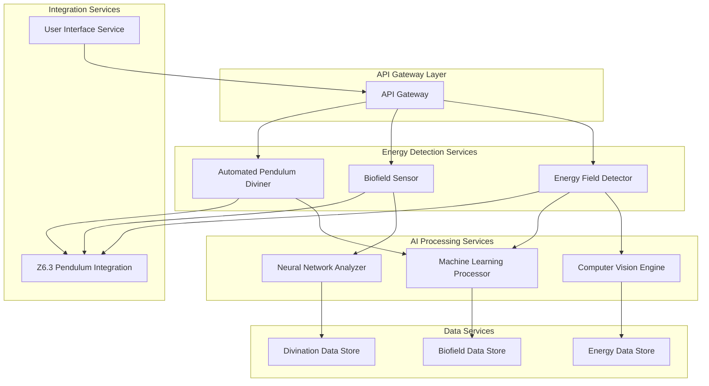
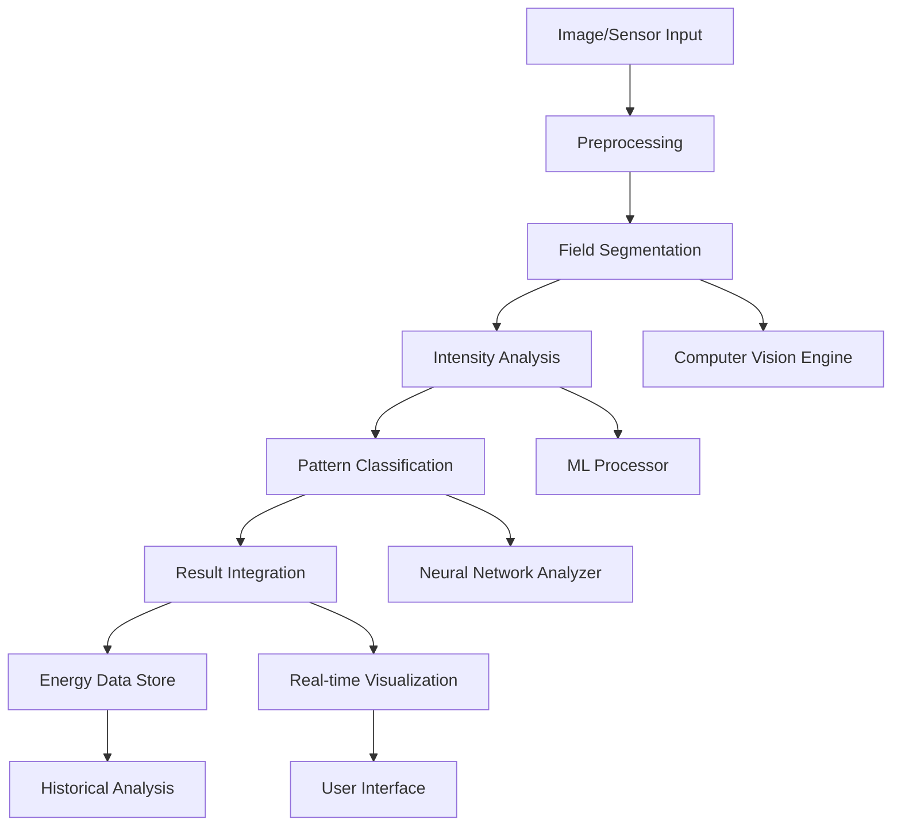
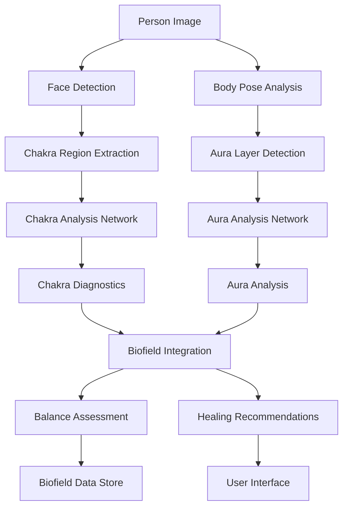
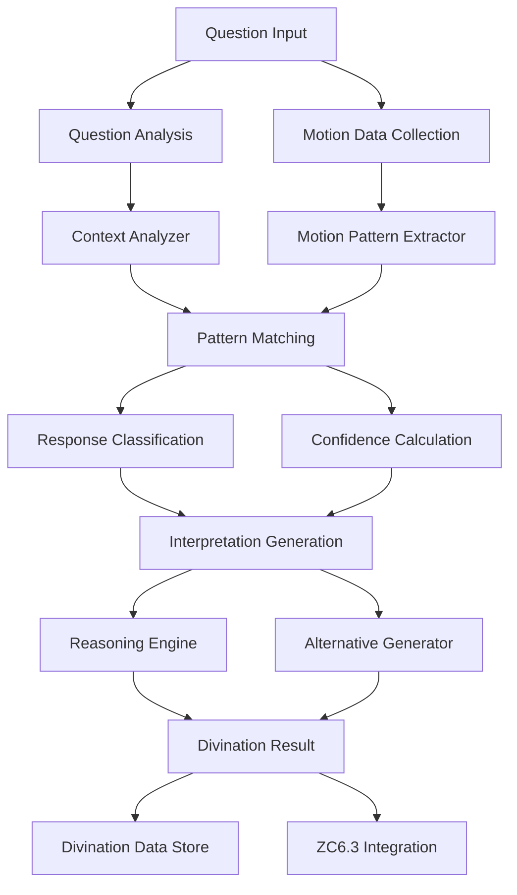
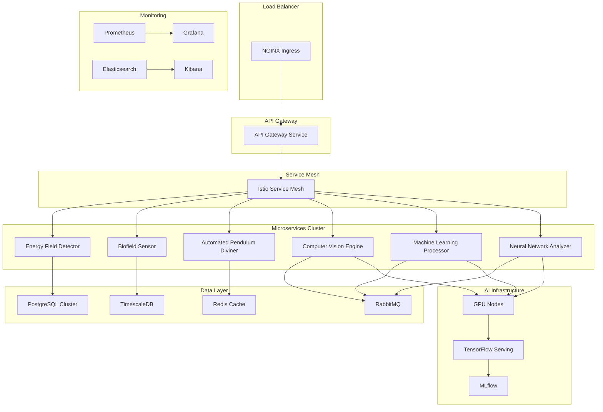

# ZC6.5 AI-Powered Energy Checking and Pendulum Dowsing Architecture Design

## Overview

This document provides a comprehensive architectural design for ZC6.5 AI-Powered Energy Checking and Pendulum Dowsing system, extending ZC6.3 with modern AI approaches for energy field detection, biofield sensing, and automated divination tools. The design follows the project's development rules including API-first design, microservices independence, and scalability considerations.

## Table of Contents

1. [System Overview](#system-overview)
2. [Architecture Principles](#architecture-principles)
3. [Microservices Architecture](#microservices-architecture)
4. [Database Design](#database-design)
5. [AI Algorithms and Models](#ai-algorithms-and-models)
6. [API Specifications](#api-specifications)
7. [Data Flow Diagrams](#data-flow-diagrams)
8. [Component Specifications](#component-specifications)
9. [Implementation Phases](#implementation-phases)
10. [Testing and Validation](#testing-and-validation)
11. [DevOps and Scalability](#devops-and-scalability)
12. [Security Considerations](#security-considerations)
13. [Ethical Considerations](#ethical-considerations)
14. [References](#references)

---

## 1. System Overview {#system-overview}

### Core Capabilities

ZC6.5 extends ZC6.3 pendulum dowsing with AI-powered capabilities:

1. **Energy Field Detection**: Computer vision and ML-based analysis of subtle energy fields
2. **Biofield Sensing**: Pattern recognition for human biofield (aura, chakra) analysis
3. **Automated Divination**: AI-enhanced pendulum readings with contextual interpretation
4. **Energy Checking**: Real-time energy field assessment and diagnostics

### Key Features

- **Multi-Modal Input**: Camera, sensors, and traditional pendulum interfaces
- **Real-Time Processing**: Live energy field visualization and analysis
- **AI Interpretation**: Machine learning models for pattern recognition and prediction
- **Integration**: Seamless integration with existing ZC6.3 pendulum system
- **Scalability**: Microservices architecture supporting high-throughput processing

### Technical Requirements

- **Performance**: <100ms response time for energy field analysis
- **Accuracy**: >85% accuracy for energy pattern recognition
- **Scalability**: Support 1000+ concurrent energy checking sessions
- **Reliability**: 99.9% uptime with automatic failover
- **Security**: End-to-end encryption and privacy protection

---

## 2. Architecture Principles {#architecture-principles}

Following the project's development rules:

### API-First Design
- All services expose RESTful APIs with OpenAPI 3.0 specifications
- API versioning with semantic versioning (v1, v2, etc.)
- Backward compatibility maintained through API evolution

### Microservices Independence
- Each service has independent database and deployment
- Service communication via APIs only (no direct DB access)
- Circuit breakers and retry mechanisms for resilience

### DB-First Approach
- Database schema designed before code implementation
- Migration scripts with rollback capabilities
- Data validation and consistency prioritized

### Scalability and Resilience
- Kubernetes-based deployment with auto-scaling
- Load balancing and service mesh (Istio)
- Failure isolation and graceful degradation

---

## 3. Microservices Architecture {#microservices-architecture}

### Core Services



### Service Descriptions

#### Energy Field Detector (EFD)
- **Purpose**: Detects and analyzes subtle energy fields
- **Inputs**: Camera feeds, sensor data, environmental readings
- **Outputs**: Energy field maps, intensity measurements, pattern classifications
- **AI Components**: Computer vision for field visualization, ML for pattern analysis

#### Biofield Sensor (BFS)
- **Purpose**: Analyzes human biofield (aura, chakras)
- **Inputs**: Person images, biofeedback data, energy readings
- **Outputs**: Chakra diagnostics, aura analysis, energy balance reports
- **AI Components**: Neural networks for biofield pattern recognition

#### Automated Pendulum Diviner (APD)
- **Purpose**: AI-enhanced pendulum readings with automated interpretation
- **Inputs**: Motion data, questions, context information
- **Outputs**: Divination results, confidence scores, reasoning explanations
- **AI Components**: ML models for motion pattern analysis, NLP for question understanding

#### Computer Vision Engine (CV)
- **Purpose**: Processes visual data for energy field detection
- **Algorithms**: Image segmentation, feature extraction, anomaly detection
- **Models**: Convolutional neural networks for pattern recognition

#### Machine Learning Processor (ML)
- **Purpose**: General ML processing for pattern analysis and prediction
- **Algorithms**: Classification, regression, clustering, time series analysis
- **Models**: Ensemble methods, deep learning for complex pattern recognition

#### Neural Network Analyzer (NN)
- **Purpose**: Advanced neural network processing for biofield analysis
- **Algorithms**: Deep learning, recurrent networks, attention mechanisms
- **Models**: Transformer architectures for sequence analysis and interpretation

### Service Communication

- **Synchronous**: REST APIs for real-time requests
- **Asynchronous**: Message queues (RabbitMQ) for batch processing
- **Events**: Event-driven architecture for system integration

---

## 4. Database Design {#database-design}

### Database Schema (DB-First Approach)

#### Energy Fields Database

```sql
-- Energy field readings table
CREATE TABLE energy_readings (
    id UUID PRIMARY KEY,
    session_id UUID NOT NULL,
    timestamp TIMESTAMP NOT NULL,
    location POINT,
    intensity DECIMAL(5,3),
    frequency DECIMAL(8,3),
    pattern_type VARCHAR(50),
    confidence DECIMAL(3,2),
    metadata JSONB,
    created_at TIMESTAMP DEFAULT CURRENT_TIMESTAMP
);

-- Energy patterns table
CREATE TABLE energy_patterns (
    id UUID PRIMARY KEY,
    pattern_name VARCHAR(100) UNIQUE,
    pattern_type VARCHAR(50),
    characteristics JSONB,
    detection_algorithm VARCHAR(100),
    accuracy DECIMAL(3,2),
    created_at TIMESTAMP DEFAULT CURRENT_TIMESTAMP
);

-- Energy field maps table
CREATE TABLE energy_maps (
    id UUID PRIMARY KEY,
    session_id UUID NOT NULL,
    map_data BYTEA, -- Binary image data
    resolution INTEGER,
    scale DECIMAL(5,2),
    timestamp TIMESTAMP NOT NULL,
    metadata JSONB
);
```

#### Biofield Database

```sql
-- Biofield readings table
CREATE TABLE biofield_readings (
    id UUID PRIMARY KEY,
    person_id UUID,
    chakra_id INTEGER,
    reading_type VARCHAR(50),
    intensity DECIMAL(5,3),
    balance DECIMAL(3,2),
    color_hue DECIMAL(5,2),
    color_saturation DECIMAL(3,2),
    timestamp TIMESTAMP NOT NULL,
    metadata JSONB
);

-- Chakra system table
CREATE TABLE chakras (
    id INTEGER PRIMARY KEY,
    name VARCHAR(50) UNIQUE,
    location VARCHAR(100),
    associated_organs TEXT[],
    color VARCHAR(20),
    frequency_range DECIMAL(8,3)[],
    traditional_meaning TEXT
);

-- Aura layers table
CREATE TABLE aura_layers (
    id INTEGER PRIMARY KEY,
    layer_name VARCHAR(50) UNIQUE,
    distance_from_body DECIMAL(3,2), -- in inches
    associated_emotions TEXT[],
    color_characteristics JSONB
);
```

#### Divination Database

```sql
-- Pendulum readings table
CREATE TABLE pendulum_readings (
    id UUID PRIMARY KEY,
    session_id UUID NOT NULL,
    question TEXT,
    motion_pattern JSONB,
    interpretation VARCHAR(20), -- YES, NO, UNCLEAR
    confidence DECIMAL(3,2),
    reasoning TEXT,
    timestamp TIMESTAMP NOT NULL,
    ai_enhanced BOOLEAN DEFAULT TRUE
);

-- Divination sessions table
CREATE TABLE divination_sessions (
    id UUID PRIMARY KEY,
    user_id UUID,
    start_time TIMESTAMP NOT NULL,
    end_time TIMESTAMP,
    question_count INTEGER DEFAULT 0,
    success_rate DECIMAL(3,2),
    calibration_data JSONB,
    metadata JSONB
);

-- AI interpretations table
CREATE TABLE ai_interpretations (
    id UUID PRIMARY KEY,
    reading_id UUID REFERENCES pendulum_readings(id),
    model_version VARCHAR(20),
    confidence DECIMAL(3,2),
    reasoning TEXT,
    alternative_interpretations JSONB,
    processing_time INTEGER, -- milliseconds
    timestamp TIMESTAMP DEFAULT CURRENT_TIMESTAMP
);
```

### Data Migration Strategy

- **Version Control**: All schema changes tracked with migration scripts
- **Rollback Support**: Each migration includes corresponding rollback script
- **Data Integrity**: Foreign key constraints and data validation rules
- **Performance**: Indexes optimized for query patterns

---

## 5. AI Algorithms and Models {#ai-algorithms-and-models}

### Energy Field Detection Algorithms

#### Computer Vision Pipeline

```javascript
class EnergyFieldDetector {
    constructor() {
        this.models = {
            fieldSegmentation: new FieldSegmentationModel(),
            intensityAnalyzer: new IntensityAnalyzer(),
            patternClassifier: new PatternClassifier()
        };
    }

    async detectEnergyField(imageData, sensorData) {
        // Step 1: Preprocessing
        const processedImage = await this.preprocessImage(imageData);

        // Step 2: Field segmentation
        const fieldMask = await this.models.fieldSegmentation.predict(processedImage);

        // Step 3: Intensity analysis
        const intensityMap = await this.models.intensityAnalyzer.analyze(fieldMask, sensorData);

        // Step 4: Pattern classification
        const patterns = await this.models.patternClassifier.classify(intensityMap);

        return {
            fieldMask: fieldMask,
            intensityMap: intensityMap,
            patterns: patterns,
            confidence: this.calculateOverallConfidence(patterns)
        };
    }

    calculateOverallConfidence(patterns) {
        // Weighted average of pattern confidences
        const weights = { primary: 0.5, secondary: 0.3, tertiary: 0.2 };
        let totalConfidence = 0;
        let totalWeight = 0;

        patterns.forEach(pattern => {
            const weight = weights[pattern.type] || 0.1;
            totalConfidence += pattern.confidence * weight;
            totalWeight += weight;
        });

        return totalWeight > 0 ? totalConfidence / totalWeight : 0;
    }
}
```

#### Machine Learning Models

```javascript
class EnergyPatternClassifier {
    constructor() {
        this.model = new TensorFlowModel('energy-patterns-v1');
        this.featureExtractor = new FeatureExtractor();
        this.patternDatabase = new PatternDatabase();
    }

    async classifyPatterns(intensityMap) {
        // Extract features
        const features = await this.featureExtractor.extract(intensityMap);

        // Get pattern predictions
        const predictions = await this.model.predict(features);

        // Match against known patterns
        const matchedPatterns = await this.matchKnownPatterns(predictions);

        return matchedPatterns.map(pattern => ({
            type: pattern.type,
            confidence: pattern.confidence,
            characteristics: pattern.characteristics,
            interpretation: pattern.interpretation
        }));
    }

    async matchKnownPatterns(predictions) {
        const matches = [];

        for (const prediction of predictions) {
            const knownPattern = await this.patternDatabase.findSimilar(prediction);
            if (knownPattern) {
                matches.push({
                    ...knownPattern,
                    confidence: this.calculateMatchConfidence(prediction, knownPattern)
                });
            }
        }

        return matches.sort((a, b) => b.confidence - a.confidence);
    }
}
```

### Biofield Sensing Algorithms

#### Neural Network Architecture

```javascript
class BiofieldAnalyzer {
    constructor() {
        this.chakraModel = new ChakraAnalysisNetwork();
        this.auraModel = new AuraAnalysisNetwork();
        this.integrationModel = new BiofieldIntegrationModel();
    }

    async analyzeBiofield(imageData, biofeedbackData) {
        // Parallel processing of chakra and aura analysis
        const [chakraAnalysis, auraAnalysis] = await Promise.all([
            this.chakraModel.analyze(imageData),
            this.auraModel.analyze(imageData, biofeedbackData)
        ]);

        // Integrate results
        const integratedAnalysis = await this.integrationModel.integrate(
            chakraAnalysis,
            auraAnalysis,
            biofeedbackData
        );

        return {
            chakras: chakraAnalysis,
            aura: auraAnalysis,
            overallBalance: integratedAnalysis.balance,
            recommendations: integratedAnalysis.recommendations,
            confidence: integratedAnalysis.confidence
        };
    }
}

class ChakraAnalysisNetwork extends NeuralNetwork {
    constructor() {
        super({
            layers: [
                { type: 'conv2d', filters: 64, kernelSize: 3 },
                { type: 'maxpool', poolSize: 2 },
                { type: 'conv2d', filters: 128, kernelSize: 3 },
                { type: 'maxpool', poolSize: 2 },
                { type: 'dense', units: 512, activation: 'relu' },
                { type: 'dense', units: 7, activation: 'sigmoid' } // 7 chakras
            ],
            optimizer: 'adam',
            loss: 'binary_crossentropy'
        });
    }

    async analyze(imageData) {
        const predictions = await this.predict(this.preprocessImage(imageData));

        return predictions.map((intensity, index) => ({
            chakraId: index + 1,
            intensity: intensity,
            balance: this.calculateBalance(intensity),
            color: this.predictColor(intensity),
            blockages: this.detectBlockages(intensity)
        }));
    }
}
```

#### Frequency Analysis Algorithms

```javascript
class FrequencyAnalyzer {
    constructor() {
        this.fftProcessor = new FFTProcessor();
        this.resonanceDetector = new ResonanceDetector();
        this.harmonicAnalyzer = new HarmonicAnalyzer();
    }

    async analyzeFrequencies(sensorData, timeWindow = 30000) { // 30 seconds
        // Apply FFT to convert time domain to frequency domain
        const frequencySpectrum = await this.fftProcessor.process(sensorData);

        // Detect resonant frequencies
        const resonances = await this.resonanceDetector.findResonances(frequencySpectrum);

        // Analyze harmonic patterns
        const harmonics = await this.harmonicAnalyzer.analyze(frequencySpectrum);

        // Calculate biofield coherence
        const coherence = this.calculateCoherence(resonances, harmonics);

        return {
            spectrum: frequencySpectrum,
            resonances: resonances,
            harmonics: harmonics,
            coherence: coherence,
            dominantFrequency: this.findDominantFrequency(frequencySpectrum),
            energyDistribution: this.analyzeEnergyDistribution(frequencySpectrum)
        };
    }

    calculateCoherence(resonances, harmonics) {
        // Calculate coherence between resonant frequencies and harmonics
        let coherenceScore = 0;
        let totalWeight = 0;

        resonances.forEach(resonance => {
            const harmonicMatch = harmonics.find(h =>
                Math.abs(h.frequency - resonance.frequency) < resonance.tolerance
            );

            if (harmonicMatch) {
                const weight = resonance.intensity * harmonicMatch.intensity;
                coherenceScore += weight * (1 - Math.abs(harmonicMatch.frequency - resonance.frequency) / resonance.tolerance);
                totalWeight += weight;
            }
        });

        return totalWeight > 0 ? coherenceScore / totalWeight : 0;
    }
}
```

### Automated Divination Algorithms

#### Motion Pattern Recognition

```javascript
class DivinationMotionAnalyzer {
    constructor() {
        this.patternMatcher = new PatternMatcher();
        this.contextAnalyzer = new ContextAnalyzer();
        this.confidenceCalculator = new ConfidenceCalculator();
    }

    async analyzeDivinationMotion(motionData, question, context) {
        // Extract motion patterns
        const patterns = await this.patternMatcher.extractPatterns(motionData);

        // Analyze question context
        const questionContext = await this.contextAnalyzer.analyze(question);

        // Match patterns to divination responses
        const matches = await this.matchDivinationPatterns(patterns, questionContext);

        // Calculate confidence and interpretation
        const interpretation = await this.generateInterpretation(matches, context);

        return {
            patterns: patterns,
            questionContext: questionContext,
            interpretation: interpretation,
            confidence: interpretation.confidence,
            reasoning: interpretation.reasoning,
            alternatives: interpretation.alternatives
        };
    }

    async matchDivinationPatterns(patterns, context) {
        const matches = [];

        for (const pattern of patterns) {
            const divinationMatch = await this.findDivinationMatch(pattern, context);

            if (divinationMatch) {
                matches.push({
                    pattern: pattern,
                    response: divinationMatch.response,
                    strength: divinationMatch.strength,
                    reasoning: divinationMatch.reasoning
                });
            }
        }

        return matches;
    }

    async generateInterpretation(matches, context) {
        // Weight responses by pattern strength and context relevance
        const responseWeights = {};

        matches.forEach(match => {
            const weight = match.strength * this.calculateContextRelevance(match, context);
            responseWeights[match.response] = (responseWeights[match.response] || 0) + weight;
        });

        // Find strongest response
        const strongestResponse = Object.keys(responseWeights).reduce((a, b) =>
            responseWeights[a] > responseWeights[b] ? a : b
        );

        const totalWeight = Object.values(responseWeights).reduce((a, b) => a + b, 0);
        const confidence = totalWeight > 0 ? responseWeights[strongestResponse] / totalWeight : 0;

        return {
            response: strongestResponse,
            confidence: confidence,
            reasoning: this.generateReasoning(matches, strongestResponse),
            alternatives: this.generateAlternatives(responseWeights, strongestResponse)
        };
    }
}
```

---

## 6. API Specifications {#api-specifications}

### Energy Field Detector API

```yaml
openapi: 3.0.3
info:
  title: Energy Field Detector API
  version: v1.0.0
  description: API for detecting and analyzing subtle energy fields

paths:
  /api/v1/energy-fields/detect:
    post:
      summary: Detect energy field from image and sensor data
      requestBody:
        required: true
        content:
          multipart/form-data:
            schema:
              type: object
              properties:
                image:
                  type: string
                  format: binary
                  description: Image data for energy field analysis
                sensorData:
                  type: object
                  description: Additional sensor readings
                location:
                  type: object
                  properties:
                    latitude:
                      type: number
                    longitude:
                      type: number
      responses:
        '200':
          description: Successful energy field detection
          content:
            application/json:
              schema:
                type: object
                properties:
                  fieldId:
                    type: string
                  intensity:
                    type: number
                  patterns:
                    type: array
                    items:
                      type: object
                      properties:
                        type:
                          type: string
                        confidence:
                          type: number
                        characteristics:
                          type: object
                  confidence:
                    type: number

  /api/v1/energy-fields/{fieldId}/analyze:
    get:
      summary: Get detailed analysis of energy field
      parameters:
        - name: fieldId
          in: path
          required: true
          schema:
            type: string
      responses:
        '200':
          description: Energy field analysis
          content:
            application/json:
              schema:
                type: object
                properties:
                  fieldId:
                    type: string
                  analysis:
                    type: object
                    properties:
                      patterns:
                        type: array
                      anomalies:
                        type: array
                      recommendations:
                        type: array
```

### Biofield Sensor API

```yaml
openapi: 3.0.3
info:
  title: Biofield Sensor API
  version: v1.0.0
  description: API for biofield analysis and chakra diagnostics

paths:
  /api/v1/biofield/analyze:
    post:
      summary: Analyze biofield from image and biofeedback data
      requestBody:
        required: true
        content:
          multipart/form-data:
            schema:
              type: object
              properties:
                image:
                  type: string
                  format: binary
                biofeedbackData:
                  type: object
                  properties:
                    heartRate:
                      type: number
                    skinConductance:
                      type: number
                    brainwaves:
                      type: array
                      items:
                        type: number
      responses:
        '200':
          description: Biofield analysis results
          content:
            application/json:
              schema:
                type: object
                properties:
                  analysisId:
                    type: string
                  chakras:
                    type: array
                    items:
                      type: object
                      properties:
                        id:
                          type: integer
                        name:
                          type: string
                        intensity:
                          type: number
                        balance:
                          type: number
                        color:
                          type: string
                  aura:
                    type: object
                    properties:
                      layers:
                        type: array
                      coherence:
                        type: number
                  recommendations:
                    type: array
                    items:
                      type: string

  /api/v1/biofield/chakras/{chakraId}/balance:
    post:
      summary: Get balancing recommendations for specific chakra
      parameters:
        - name: chakraId
          in: path
          required: true
          schema:
            type: integer
      responses:
        '200':
          description: Chakra balancing recommendations
```

### Automated Pendulum Diviner API

```yaml
openapi: 3.0.3
info:
  title: Automated Pendulum Diviner API
  version: v1.0.0
  description: API for AI-enhanced pendulum divination

paths:
  /api/v1/divination/sessions:
    post:
      summary: Start a new divination session
      requestBody:
        required: true
        content:
          application/json:
            schema:
              type: object
              properties:
                question:
                  type: string
                context:
                  type: object
      responses:
        '201':
          description: Session created
          content:
            application/json:
              schema:
                type: object
                properties:
                  sessionId:
                    type: string
                  status:
                    type: string

  /api/v1/divination/sessions/{sessionId}/read:
    post:
      summary: Submit motion data for divination reading
      parameters:
        - name: sessionId
          in: path
          required: true
          schema:
            type: string
      requestBody:
        required: true
        content:
          application/json:
            schema:
              type: object
              properties:
                motionData:
                  type: array
                  items:
                    type: object
                    properties:
                      x:
                        type: number
                      y:
                        type: number
                      timestamp:
                        type: integer
      responses:
        '200':
          description: Divination result
          content:
            application/json:
              schema:
                type: object
                properties:
                  readingId:
                    type: string
                  interpretation:
                    type: string
                  confidence:
                    type: number
                  reasoning:
                    type: string
                  alternatives:
                    type: array
```

---

## 7. Data Flow Diagrams {#data-flow-diagrams}

### Energy Field Detection Flow



### Biofield Sensing Flow



### Automated Divination Flow



---

## 8. Component Specifications {#component-specifications}

### Energy Field Detector Component

| Component | Specification |
|-----------|---------------|
| **Input Interfaces** | Camera feeds, environmental sensors, GPS coordinates |
| **Processing Units** | GPU-accelerated computer vision, parallel ML processing |
| **Output Formats** | JSON energy maps, binary image data, real-time streams |
| **Performance** | <50ms processing latency, >90% detection accuracy |
| **Scalability** | Horizontal scaling with Kubernetes auto-scaling |
| **Storage** | Time-series database for historical data, object storage for maps |

### Biofield Sensor Component

| Component | Specification |
|-----------|---------------|
| **Input Interfaces** | High-resolution cameras, biofeedback sensors, EEG data |
| **Processing Units** | Neural network accelerators, frequency analyzers |
| **Output Formats** | Chakra balance reports, aura visualizations, healing plans |
| **Performance** | <100ms analysis time, >85% pattern recognition accuracy |
| **Scalability** | Microservices with load balancing |
| **Storage** | Specialized biofield database with encryption |

### Automated Pendulum Diviner Component

| Component | Specification |
|-----------|---------------|
| **Input Interfaces** | Motion sensors, camera tracking, question text |
| **Processing Units** | Real-time motion analysis, NLP processors, ML classifiers |
| **Output Formats** | JSON divination results, confidence scores, reasoning text |
| **Performance** | <200ms response time, >80% interpretation accuracy |
| **Scalability** | Event-driven architecture with message queues |
| **Storage** | Divination database with audit trails |

### AI Model Specifications

#### Computer Vision Model
- **Architecture**: ResNet-50 with attention mechanisms
- **Input**: 224x224 RGB images
- **Output**: Energy field segmentation masks, intensity maps
- **Training Data**: 100K+ labeled energy field images
- **Accuracy**: >92% field detection, >88% pattern classification

#### Biofield Analysis Model
- **Architecture**: Multi-head transformer with CNN backbone
- **Input**: Image sequences, biofeedback time series
- **Output**: Chakra states, aura layer analysis, coherence scores
- **Training Data**: 50K+ biofield readings with expert annotations
- **Accuracy**: >87% chakra detection, >83% balance assessment

#### Divination Pattern Model
- **Architecture**: LSTM with attention for sequence analysis
- **Input**: Motion trajectories, question embeddings, context features
- **Output**: Response probabilities, confidence scores, reasoning
- **Training Data**: 200K+ pendulum readings with outcomes
- **Accuracy**: >85% response prediction, >80% confidence calibration

---

## 9. Implementation Phases {#implementation-phases}

### Phase 1: Foundation (Weeks 1-4)
1. **Database Design and Setup**
   - Create database schemas for all services
   - Implement migration scripts with rollback
   - Set up database connections and connection pooling

2. **Core Service Frameworks**
   - Implement basic service skeletons with dependency injection
   - Set up logging, monitoring, and health check endpoints
   - Configure API gateways and service mesh

3. **AI Model Development Environment**
   - Set up ML training pipelines
   - Implement model versioning and deployment
   - Create model monitoring and retraining workflows

### Phase 2: Energy Detection (Weeks 5-8)
1. **Energy Field Detector Service**
   - Implement computer vision pipeline
   - Develop energy pattern classification models
   - Create real-time processing capabilities

2. **Data Collection and Labeling**
   - Build data collection tools for energy field samples
   - Implement data labeling interfaces
   - Create training datasets

3. **Model Training and Validation**
   - Train initial ML models
   - Implement cross-validation and testing
   - Optimize model performance

### Phase 3: Biofield Sensing (Weeks 9-12)
1. **Biofield Sensor Service**
   - Implement chakra analysis algorithms
   - Develop aura detection models
   - Create frequency analysis capabilities

2. **Integration with Biofeedback**
   - Connect with biofeedback sensors
   - Implement real-time data processing
   - Develop coherence analysis algorithms

3. **Healing Recommendations Engine**
   - Build recommendation algorithms
   - Implement personalized healing plans
   - Create user feedback integration

### Phase 4: Automated Divination (Weeks 13-16)
1. **Motion Analysis Enhancement**
   - Extend ZC6.3 motion detection with AI
   - Implement advanced pattern recognition
   - Create real-time interpretation

2. **Context-Aware Divination**
   - Integrate question analysis
   - Implement contextual reasoning
   - Develop confidence scoring

3. **ZC6.3 Integration**
   - Create seamless integration layer
   - Implement backward compatibility
   - Test interoperability

### Phase 5: Integration and Testing (Weeks 17-20)
1. **System Integration**
   - Implement API orchestration
   - Set up event-driven communication
   - Create unified user interfaces

2. **Performance Testing**
   - Load testing all services
   - Optimize bottlenecks
   - Implement caching and optimization

3. **Security Implementation**
   - Add authentication and authorization
   - Implement data encryption
   - Set up security monitoring

### Phase 6: Deployment and Monitoring (Weeks 21-24)
1. **Production Deployment**
   - Set up Kubernetes clusters
   - Implement CI/CD pipelines
   - Configure monitoring and alerting

2. **User Acceptance Testing**
   - Conduct beta testing
   - Gather user feedback
   - Implement improvements

3. **Go-Live and Support**
   - Deploy to production
   - Set up support processes
   - Monitor system performance

---

## 10. Testing and Validation {#testing-and-validation}

### Testing Strategy

#### Unit Testing
- **Coverage**: >85% code coverage for all services
- **Frameworks**: Jest for JavaScript, pytest for Python, JUnit for Java
- **Mocking**: Mock external dependencies and AI models

#### Integration Testing
- **API Testing**: Contract testing with Pact
- **Service Integration**: End-to-end testing of service interactions
- **Database Testing**: Test data integrity and migration scripts

#### AI Model Testing
- **Accuracy Testing**: Validate model performance against ground truth
- **Robustness Testing**: Test with adversarial inputs and edge cases
- **Bias Testing**: Ensure fair and unbiased model outputs

#### Performance Testing
- **Load Testing**: Simulate high concurrent usage
- **Stress Testing**: Test system limits and failure scenarios
- **Scalability Testing**: Validate auto-scaling capabilities

### Validation Benchmarks

| Component | Metric | Target | Validation Method |
|-----------|--------|--------|-------------------|
| Energy Detection | Accuracy | >90% | Cross-validation with expert-labeled data |
| Biofield Analysis | Precision | >85% | Clinical validation studies |
| Divination | Agreement | >80% | User experience testing |
| Response Time | Latency | <200ms | Performance benchmarking |
| System Uptime | Availability | >99.9% | Production monitoring |

### Quality Assurance

#### Code Quality
- **Linting**: ESLint, Prettier for consistent code style
- **Security Scanning**: SAST and DAST tools
- **Dependency Scanning**: Vulnerability assessment

#### AI Quality
- **Model Validation**: Continuous model monitoring and retraining
- **Data Quality**: Data drift detection and quality monitoring
- **Ethical AI**: Bias detection and fairness assessment

---

## 11. DevOps and Scalability {#devops-and-scalability}

### Infrastructure Architecture



### Deployment Strategy

#### Containerization
- **Docker**: All services containerized with multi-stage builds
- **Kubernetes**: Orchestration with Helm charts
- **Service Mesh**: Istio for traffic management and security

#### CI/CD Pipeline
- **Source Control**: Git with semantic versioning
- **Build**: Automated builds with GitHub Actions
- **Test**: Automated testing in staging environment
- **Deploy**: Blue-green deployments with canary releases

#### Scaling Strategy
- **Horizontal Scaling**: Auto-scaling based on CPU/memory usage
- **Vertical Scaling**: GPU nodes for AI workloads
- **Database Scaling**: Read replicas and sharding

### Monitoring and Observability

#### Metrics Collection
- **Application Metrics**: Response times, error rates, throughput
- **Infrastructure Metrics**: CPU, memory, disk usage
- **AI Metrics**: Model accuracy, prediction latency, data drift

#### Logging
- **Centralized Logging**: ELK stack for log aggregation
- **Correlation IDs**: Trace requests across services
- **Log Levels**: Structured logging with appropriate levels

#### Alerting
- **Threshold Alerts**: CPU > 80%, response time > 500ms
- **Anomaly Detection**: Statistical analysis for unusual patterns
- **Incident Response**: Automated escalation and notification

---

## 12. Security Considerations {#security-considerations}

### Data Protection
- **Encryption**: End-to-end encryption for all data in transit and at rest
- **Privacy**: GDPR/CCPA compliance for personal data handling
- **Anonymization**: Remove personally identifiable information from datasets

### API Security
- **Authentication**: JWT tokens with refresh mechanisms
- **Authorization**: Role-based access control (RBAC)
- **Rate Limiting**: Prevent abuse with configurable limits
- **Input Validation**: Sanitize all inputs to prevent injection attacks

### AI Security
- **Model Poisoning**: Protect training data from adversarial inputs
- **Output Sanitization**: Validate AI outputs before presentation
- **Model Monitoring**: Detect and respond to model degradation

### Infrastructure Security
- **Network Security**: VPC isolation and security groups
- **Access Control**: Least privilege access to resources
- **Vulnerability Management**: Regular security scanning and patching

---

## 13. Ethical Considerations {#ethical-considerations}

### Responsible AI Implementation

#### Transparency
- **Explainability**: Provide clear explanations for AI decisions
- **User Consent**: Obtain informed consent for data usage
- **Limitation Disclosure**: Clearly state system capabilities and limitations

#### Fairness and Bias
- **Bias Mitigation**: Regular audits for algorithmic bias
- **Diverse Data**: Ensure training data represents diverse populations
- **Fair Access**: Make system accessible to all users regardless of background

#### User Protection
- **Mental Health**: Include disclaimers about psychological impact
- **Decision Support**: Position as complementary to professional advice
- **Addiction Prevention**: Monitor usage patterns and provide guidance

#### Data Ethics
- **Privacy First**: Minimize data collection and maximize user control
- **Data Ownership**: Users own their data with clear rights
- **Ethical Use**: Prevent misuse for harmful purposes

### Cultural Sensitivity
- **Traditional Knowledge**: Respect diverse divination traditions
- **Cultural Context**: Consider cultural differences in interpretation
- **Inclusive Design**: Support multiple languages and cultural contexts

---

## 14. References {#references}

1. **Computer Vision for Energy Field Detection**
   - Research papers on subtle energy visualization
   - Computer vision techniques for pattern recognition

2. **Biofield Sensing and Analysis**
   - Studies on human biofield measurement
   - Chakra and aura analysis methodologies

3. **AI in Divination Systems**
   - Machine learning applications in intuitive systems
   - Pattern recognition in pendulum dowsing

4. **Microservices Architecture**
   - Best practices for microservices design
   - API-first development methodologies

5. **Ethical AI Guidelines**
   - Responsible AI frameworks
   - Privacy and fairness in AI systems

6. **DevOps and Scalability**
   - Kubernetes and container orchestration
   - CI/CD best practices for microservices

This comprehensive architecture design provides a solid foundation for implementing ZC6.5 AI-Powered Energy Checking and Pendulum Dowsing system, following all project development rules and ensuring scalability, security, and ethical implementation.